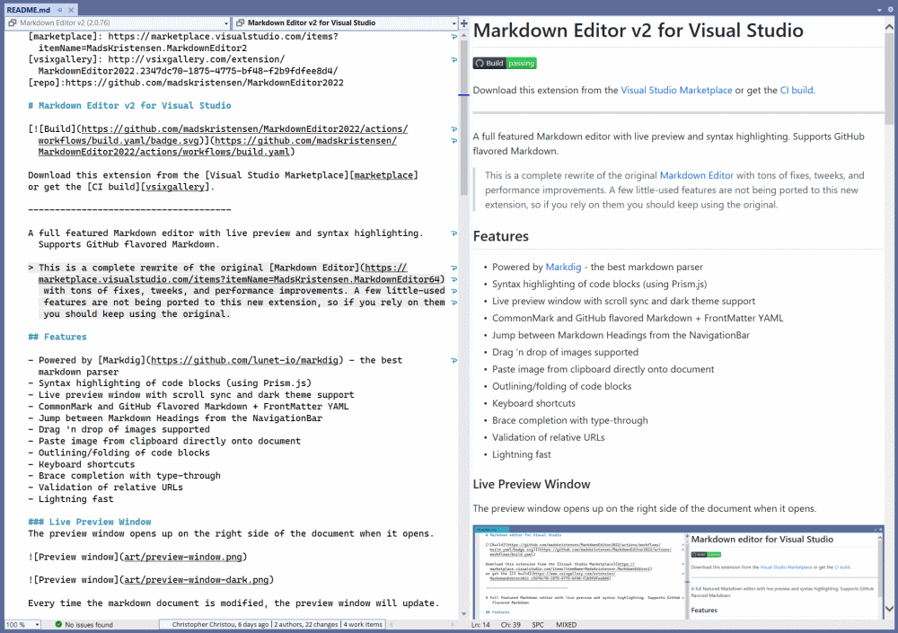
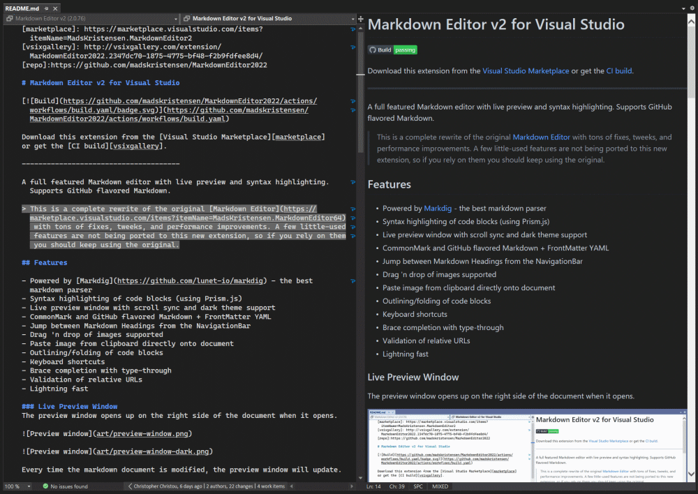
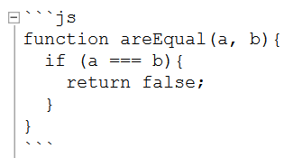
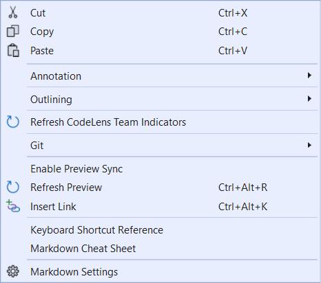
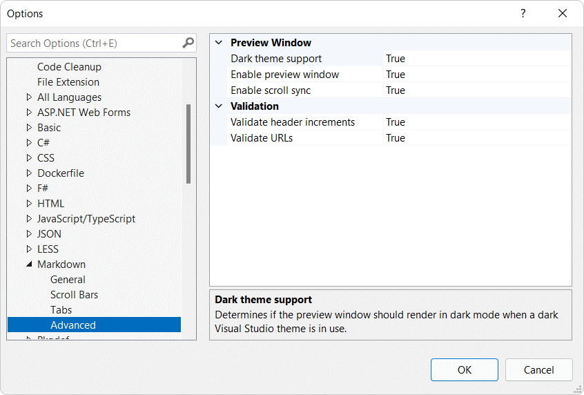

# Markdown editor for Visual Studio

[](https://github.com/madskristensen/MarkdownEditor2022/actions/workflows/build.yaml)

Download this extension from the [Visual Studio Marketplace](https://marketplace.visualstudio.com/items?itemName=MadsKristensen.MarkdownEditor2)
or get the [CI build](https://www.vsixgallery.com/extension/MarkdownEditor2022.2347dc70-1875-4775-bf48-f2b9fdfee8d4).

--------------------------------------

A full featured Markdown editor with live preview and syntax highlighting. Supports GitHub flavored Markdown.

## Features

- Powered by [Markdig](https://github.com/lunet-io/markdig) - the best markdown parser
- Syntax highlighting of code blocks (using Prism.js)
- Live preview window with scroll sync and dark theme support
- CommonMark and GitHub flavored Markdown
- High-DPI support
- Drag 'n drop of images supported
- Paste image from clipboard directly onto document
- Outlining/folding of code blocks
- Keyboard shortcuts
- Brace completion with type-through
- Validation of relative URLs
- Lightning fast

### Live Preview Window
The preview window opens up on the right side of the document when it opens.






Every time the markdown document is modified, the preview window will update.

The preview window is automatically scrolled to match the scroll position of the document. As the document is scrolled up and down, the preview window will follow.

Live preview can be disabled in the [settings](#settings).

### Syntax highlighting
All fonts can be changed in **Tools -> Options -> Environment -> Fonts and Colors** dialog.


#### GitHub and other flavors
Advanced markdown extensions are supported to give more features to the syntax. This includes pipe tables, emoji, mathematics and a lot
more.

### Drag 'n drop images
Drag an image directly from Solution Explorer onto the document to insert the appropriate markdown that will render the image.

### Paste images
This is really helpful for copying images from a browser or for inserting screen shots. Simply copy an image into the clipboard and paste it directly into the document. This will prompt you for a file name relative to the document and then it inserts the appropriate markdown.

It will even parse the file name and make a friendly name to use for the alt text.

### Outlining
Any fenced code and HTML blocks can be collapsed, so that this:



...can be collapsed into this:


### Keyboard shortcuts
**Ctrl+Alt+R** Refresh the preview window.

**Ctrl+Alt+K** Inserts a new link.

**Ctrl+B** makes the selected text bold by wrapping it with `**`.

**Ctrl+I** makes the selected text italic by wrapping it with `_`.

<!--**Ctrl+Shift+C** wraps the selected text in a code block.-->
**Ctrl+Space** checks and unchecks task list items.

```markdown
- [x] task list item
```

**Tab** increases indentation of list items.

**Shift+Tab** decreases indentation of list items.

**Ctrl+K,C** wraps the selection with HTML comments.

**Ctrl+K,U** removes HTML comments surrounding the selection/caret.

<!--**Ctrl+PgUp** moves caret to previous heading

**Ctrl+PgDown** moves caret to next heading-->

## Validation
Relative URLs are validated and will show a red squiggly when they can't be resolved.


The errors will also be listed in the Error List.

## Context menu
Right-click anywhere in the markdown document to get easy access to common tasks, such as toggling the preview window scroll sync, see Markdown references, and getting to the settings dialog.



### Settings
Control the settings for this extension under
**Tools -> Options -> Text Editor -> Markdown**

